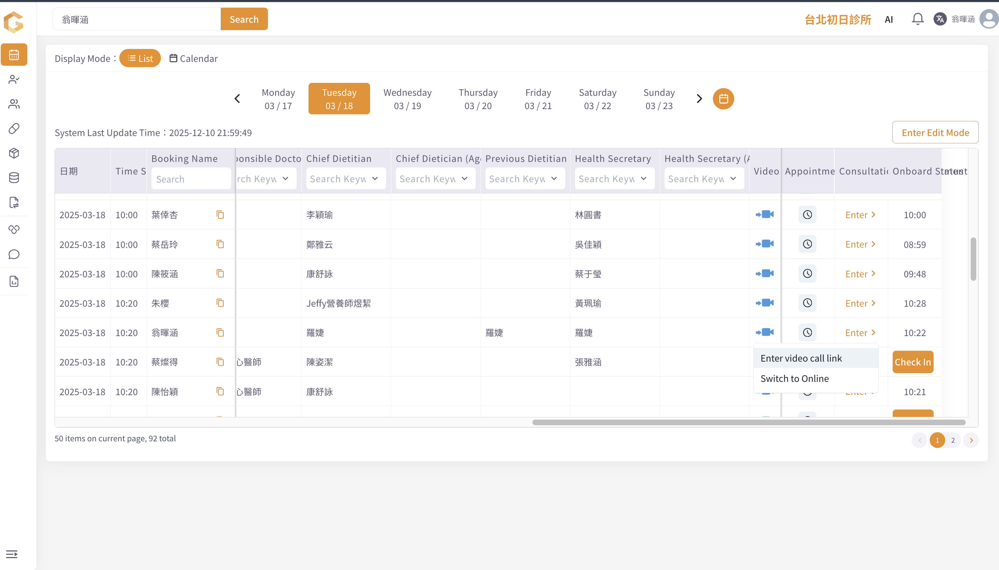

# 📋 How to do the pre-consultation and where to view the consultation report

### Guide to Conducting a Pre-Consultation and Accessing Results

**1. Start the Pre-Consultation** [0:00](https://loom.com/share/b9b3a34084f44a77b45df97c299ee2d2?t=0)

<figure><figcaption></figcaption></figure>

* Locate your patient/client in the system.
* Click on the video icon to enter the video call.
* The system will automatically initiate a Google Meet to record the consultation.

**2. Conduct the Pre-Consultation** [0:24](https://loom.com/share/b9b3a34084f44a77b45df97c299ee2d2?t=24)

* Complete the pre-consultation process with your client.
* Once finished, end the Google Meet.

**3. Access Client Profile and Diagnosis Tab** [0:42](https://loom.com/share/b9b3a34084f44a77b45df97c299ee2d2?t=42)

* Enter your client's profile in the system.
* Navigate to the 'Diagnosis' tab.

**4. Review AI Summary** [0:55](https://loom.com/share/b9b3a34084f44a77b45df97c299ee2d2?t=55)

* An AI-generated summary of the consultation will appear.
* This summary is based on the transcript from the Google Meet.

**5. Utilize Client Questionnaire** [1:07](https://loom.com/share/b9b3a34084f44a77b45df97c299ee2d2?t=67)

* Gather information from the client's questionnaire.
* Conduct the consultation in accordance with this questionnaire.

**6. Add Comments for the Doctor** [1:24](https://loom.com/share/b9b3a34084f44a77b45df97c299ee2d2?t=84)

* Ask relevant questions to your client.
* Add comments that are important for the doctor to know.
* Click 'send' to submit the comments.

**7. Edit or Delete Comments** [1:35](https://loom.com/share/b9b3a34084f44a77b45df97c299ee2d2?t=95)

* To edit a comment, click 'edit', make changes, and save.
* To delete a comment, click 'delete'.

**8. Compare Questionnaire Responses** [1:43](https://loom.com/share/b9b3a34084f44a77b45df97c299ee2d2?t=103)

* Use the 'compare' function to view answers from different dates.
* Review both the answers and comments for comparison.

**9. Doctor's Access to Pre-Consultation Results** [2:13](https://loom.com/share/b9b3a34084f44a77b45df97c299ee2d2?t=133)

* As a doctor, navigate to the 'Diagnosis' tab to view:
  * Comments made by the pre-consultant.
  * The AI summary generated after the consultation.

**10. Summary Timing** [2:26](https://loom.com/share/b9b3a34084f44a77b45df97c299ee2d2?t=146)

* Note that the AI summary typically takes about 3 to 5 minutes to appear after the Google Meet ends.

#### Link to Loom

[https://loom.com/share/b9b3a34084f44a77b45df97c299ee2d2](https://loom.com/share/b9b3a34084f44a77b45df97c299ee2d2)
